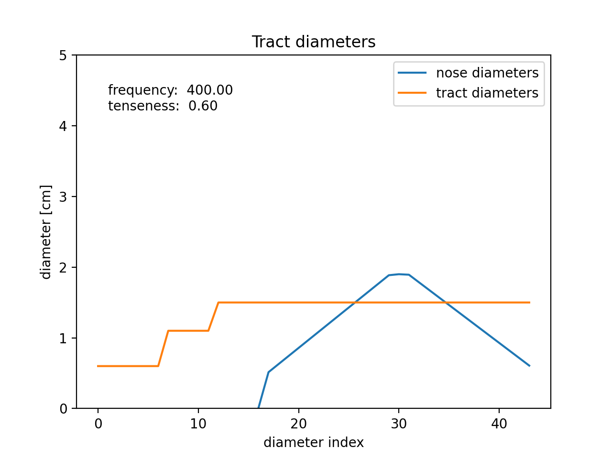

# PynkTromboneGym
The vocal tract environment for speech generations by reinforcement learning.

# Installation
Clone this repository, and run a following command.
```sh
pip install -e .
```

# Environment Definition
PynkTromboneEnvは人間のVocal Tractをシミュレーションし、強化学習の枠組みを用いて音声生成タスクを定義するためのEnvironmentです.

## Construction (`__init__`)
環境を構築します。いくつか指定する必要のある項目（引数）が存在します。
- target_sounds: Iterable[str]  
    模倣対象となる音声ファイル群を渡します。`wav`形式が望ましいですが、ffmpegをインストールしている場合は`mp3`などの形式も読み込む事ができます。
- sample_rate: float  
    生成する音声の解像度です。ターゲットとなる音声もこのサンプリングレートに合わせられます。
- default_frequency: float  
    基準となる声の高さです。この周波数から上下1オクターブが生成可能な周波数帯です。

- generate_chunk: int  
    1ステップで生成する音声波形の長さです。pynkTromboneではデフォルトで`1024`です。
- stft_window_size: int  
    波形をstftする時のウィンドウサイズです。デフォルトでは`1024`です。

- stft_hop_length: int  
    波形をstftする時のホップ幅です。デフォルトは`stft_window_size/4`を使用します。

- set_target_sounds(file_paths: Iterable[str]) : method  
    このメソッドを使用することで使用する音声ファイル群を変更する事ができます。

### PynkTromboneLogMel
stftによって生成されたスペクトログラムをメル周波数スペクトログラムにした後、対数スケールに変換する派生クラスです。

- mel_channels: int  
    Melスケールにする時のチャネル数です。デフォルト値は`80`です。

### Reset
環境をリセットします。ランダムに音声ファイルを選択し、ランダムな開始位置から切り出してターゲット音声とします。内部のVocal Tract モデルもリセットします。
返り値として、初期状態を返します。

## State
音声生成を強化学習の枠組みで行うために必要な状態情報を定義します。これらはOpenAI GymのAPIを用いて`Dict`型で返されます。

- target_sound_spectrogram    
    次のステップで生成する波形のスペクトログラムです。

- generated_sound_spectrogram  
    前のステップまでで生成した波形のスペクトログラムです。報酬計算に使用されています。
- frequency, pitch_shift  
    現在の声帯の周波数と、`default_frequency`からピッチシフトした大きさ（指数部）を返します。
- tenseness  
    現在の声帯の掠れ具合の値です。`<Env>.voc.tenseness`からもアクセスする事ができます。
- current_tract_diameters  
    円筒列で近似した声道の現在の直径の値を配列で返します。
- nose_diameters  
    円筒列で近似した鼻腔の現在の直径の値を配列で返します。

## Action

- Glottis  
    声門を調整します。
    - pitch_shift  
        Range: [-1, 1] (この値は環境をラップすることで変更できます。)  
        `default_frequency`からどれだけピッチシフトをする値です。周波数は次の式で与えられます。  
        
        $$ frequency = default \ frequency \times  2^{pitch \ shift} $$

    - tenseness  
        Range: [0, 1]  
        声の掠れ具合です。  
- tract_diameters  
    [詳細はPynkTromboneのREADME.mdを参照願います。](https://github.com/Geson-anko/pynktrombone)
    - trachea  
        Range: [0, 3.5]  
    - epiglottis  
        Range: [0, 3.5]  
    - velum  
        Range: [0, 3.5]  
    - tongue_index  
        Range: [12, 40]
    - tongue_diameter  
        Range: [0, 3.5]
    - lips  
        Range: [0, 1.5]

### Step
上記のアクションは、全て`Voc`の調整のみに使われます。  
`Voc.play_chunk()`によって音声波形を生成し、観測、報酬、終了判定、デバッグ情報を返します。  

#### About `done`
ターゲットとなる音声の長さに生成波形が達した場合、`done`となります。この状態で行動しようとすると例外を返します。  

## Reward  
`#State`のtarget_soundとgenerated_soundの平均二乗誤差の符号を反転させた値を返します。


## Visualize (Render)
`current_tract_diameters`と`nose_diameters`をplotした画像を返します。  
次のような形でプロットされます。


# References
https://www.imaginary.org/program/pink-trombone#all-downloads

